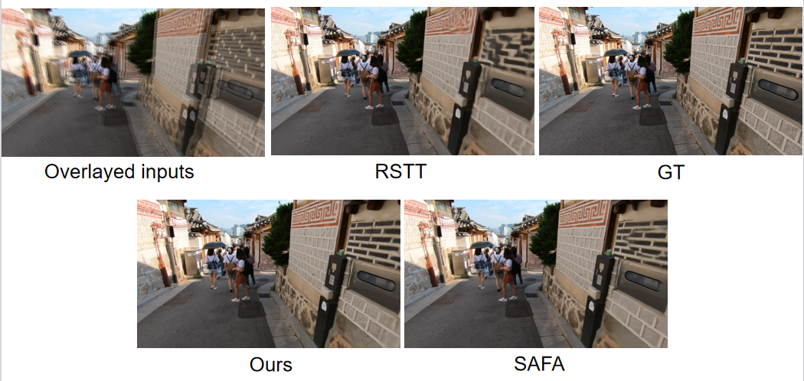
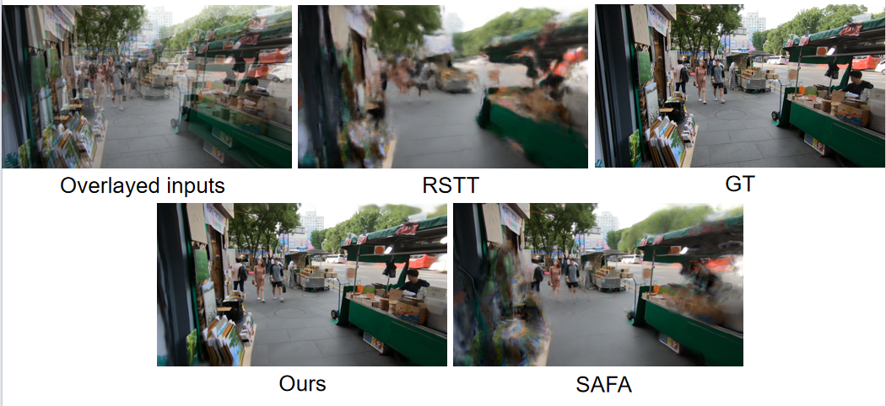
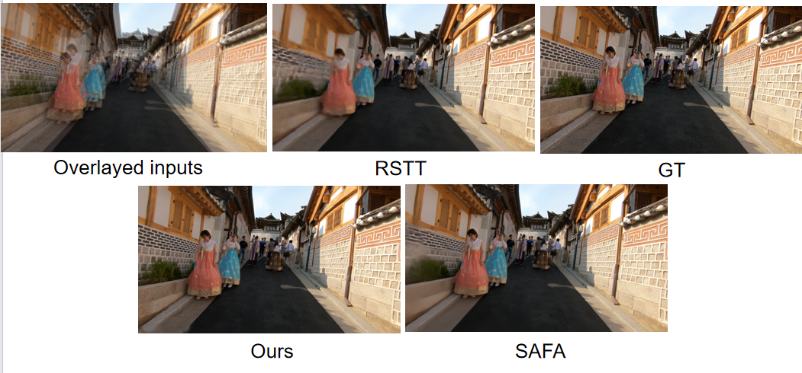
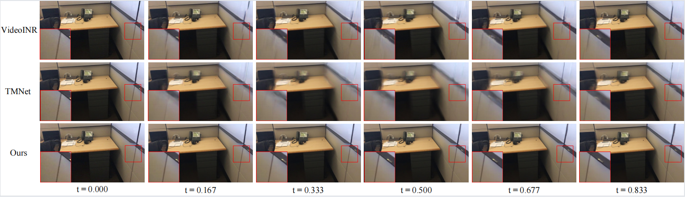
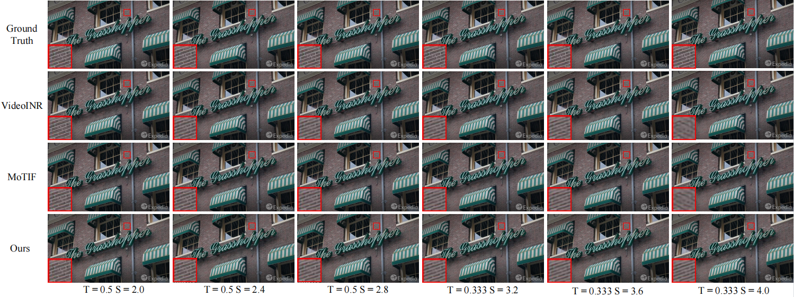
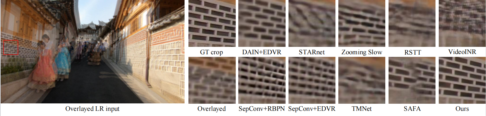
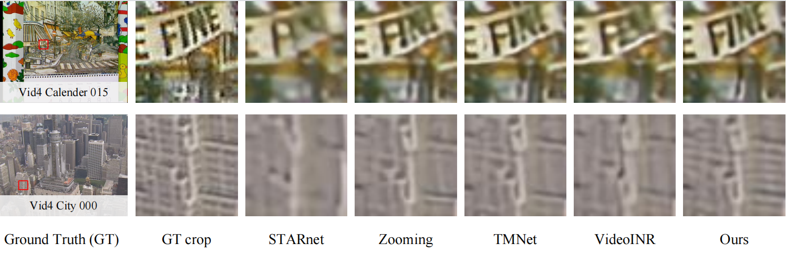

# Introduction

This is the implementation of  the paper "Continuous Space-Time Video Super-Resolution with Multi-stage Motion Information Reorganization".
Space-time video super-resolution (ST-VSR) aims to simultaneously expand a given source video to a higher frame rate and resolution. However, most existing schemes either consider fixed intermediate time and scale or fail to exploit long-range temporal information due to model design or inefficient motion estimation and compensation. To address these problems, we propose a continuous ST-VSR  method to convert the given video to any frame rate and spatial resolution with multi-stage motion information reorganization (MsMr). To achieve time-arbitrary interpolation, we propose a forward warping guided frame synthesis module and an optical-flow-guided context consistency loss to better approximate extreme motion and preserve similar structures among input and prediction frames. To realize continuous spatial upsampling, we design a memory-friendly cascading depth-to-space module. Meanwhile, with the sophisticated reorganization of optical flow, MsMr realizes more efficient motion estimation and motion compensation, making it possible to propagate information from long-range neighboring frames and achieve better reconstruction quality. Extensive experiments show that the proposed algorithm is flexible and performs better on various datasets than the state-of-the-art methods.

**Our paper is currently under peer review, and a detailed introduction will be coming soon.**
# visual comparisons
Our MsMr exhibits a clear subjective visual advantage in handling large motions.










# Pre-trained models

[BaiduCloud](https://pan.baidu.com/s/1eiiLGqhOMman6CPgp9LeFA)

password: kzdi 

model_arb refer to model that trained in space-time arbitrary manner.
model_fix refer to model that trained in fixed space-time scale factor(space 4x and time 2x).


# Environment
We are good in the environment:

python 3.7

CUDA 9.1

Pytorch 1.5.0


# Run a demo


you should specify the GT path and output path first, and run:


```
cd src

python test_vid4.py
```

# Acknowledgment
Our code is built on

 [Zooming-Slow-Mo-CVPR-2020](https://github.com/Mukosame/Zooming-Slow-Mo-CVPR-2020)

 [softsplatting](https://github.com/sniklaus/softmax-splatting)

 [open-mmlab](https://github.com/open-mmlab)

 [bicubic_pytorch](https://github.com/sanghyun-son/bicubic_pytorch)
 
 We thank the authors for sharing their codes!
